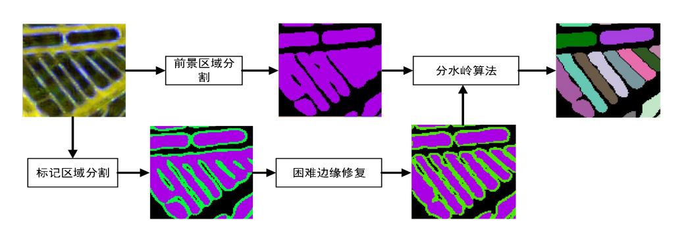
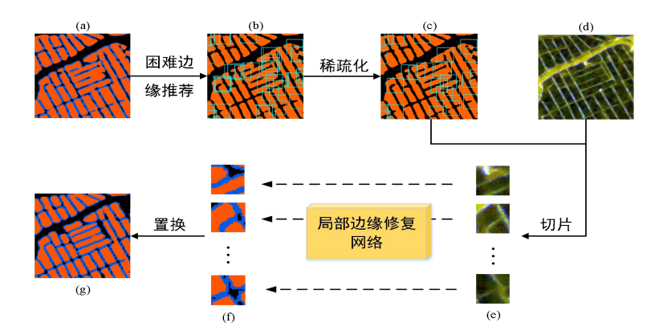
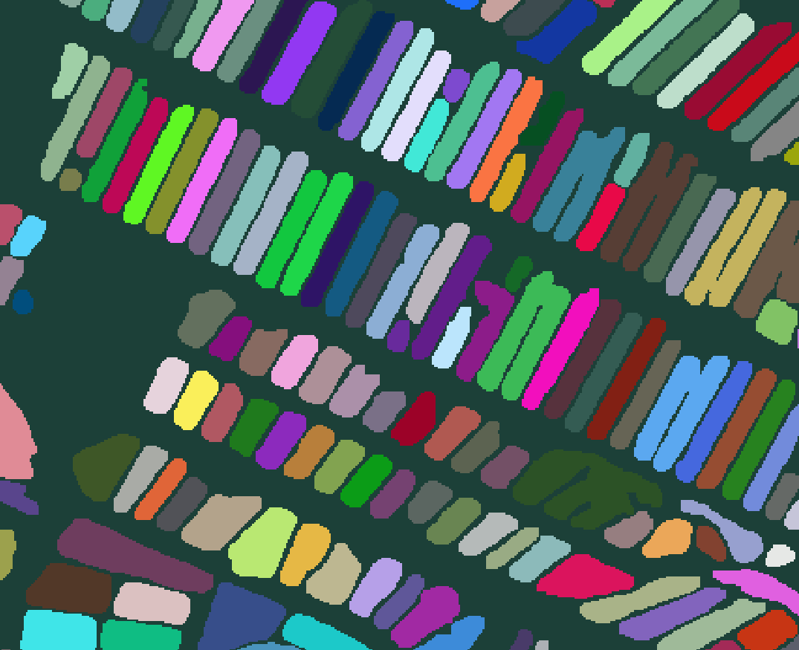

# Introduction

This repository is the official implementation of  the difficult boundary repair method. The main work flow is as follows:



This method can be split into two steps: 1. getting coarse segmentation via U-Net; 2. According to the difficult boundary proposals, repairing the boundary in a patch.



# Requirements

- torch
- torchvision
- opencv-python
- gdal

# How to use

1. train your custom coarse segmentation model

   ```
   cd fishpondTrain
   python train.py --dataRoot ${your data root} --in_chs 1 --num_classes 2
   ```

2. prediction(coarse segmentation)

   ```
   cd fishpondTrain
   python predict.py --data_path ${the path of image} --seg_model_path ${coarse segmentation model}
   ```

3. patch repair (training and prediction)

# Acknowledgement

Thanks for completing this project with Dr. Yu's help.

   ```
   cd PatchSeg
   python train.py --dataRoot ${your data path}
   python PatchPredict.py --imgPath entropy_shannon_subset_Feature.tif --CoarseSegPath coarse.tif --modelPath patch.pth --outPath final.tif
   ```

# Final result


